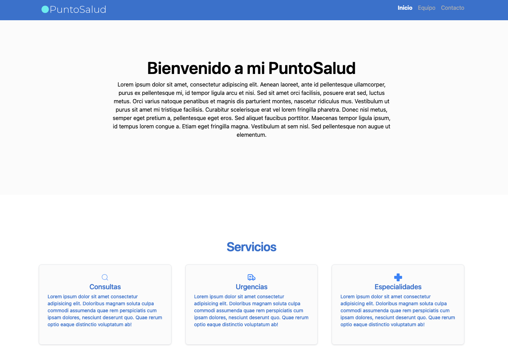

# Evaluacion Modulo 5 Ejercicio 1

## 📖 Descripción
En este proyecto, los estudiantes deberán implementar el consumo de una API para obtener y
mostrar datos del sistema del hospital, como la información de doctores o servicios médicos.
Utilizando useEffect y useState, se espera que realicen peticiones asíncronas, gestionen el
estado y manejen los errores de manera eficiente. Podrán utilizar Fetch API o Axios según su
preferencia.



## 🔴 Porque elegí Fetch API para el Consumo de la API

Fetch API tiene algunas ventajas por sobre Axios como son 

* No requiere instalar ninguna librería adicional.
* Facilita el manejo de respuestas asíncronas.
* Es más ligero al no requerir dependencias externas
* Soporta de manera nativa los métodos como GET, POST, PUT, DELETE, etc.

Para este proyecto, no se requieren algunas de las características adicionales que ofrece Axios, como el manejo de errores HTTP o la compatibilidad con navegadores desactualizados, como Internet Explorer.


## 📁 Proyecto

```plaintext
/Modulo4Ejercicio3
│
├── public
│   ├── assets
│   │   └── **.jpg/png/svg/ico
│   └── vite.svg
├── src
│   ├── App.jsx
│   ├── assets
│   │   └── react.svg
│   ├── components
│   │   ├── AppointmentForm.jsx
│   │   ├── BotonPrueba.jsx
│   │   ├── CitaConfirmada.jsx
│   │   ├── DoctorCard.jsx
│   │   ├── Footer.jsx
│   │   ├── Header.jsx
│   │   ├── ServiceList.jsx
│   │   ├── WithMoreInfo.jsx
│   │   ├── doctores.json
│   │   └── NavBar.jsx
│   ├── pages
│   │   ├── Contacto.jsx
│   │   ├── Equipo.jsx
│   │   └── Inicio.jsx
│   ├── index.css
│   └── main.jsx
├── README.md
├── eslint.config.js
├── index.html
├── package-lock.json
├── package.json
└── vite.config.js
```

### 📋 Prerrequisitos 

- Instalación de Node.js.
- Editor de texto (VS Code recomendado).

### 👁️ Instalación

Clona este repositorio en tu máquina local:

```bash
git clone https://github.com/bastianorte/Modulo5E1.git
```

Navega hasta el directorio del proyecto:

```bash
cd Modulo5E1
```

Instala las dependencias:

```bash
npm install
```

Inicia el servidor de desarrollo:

```bash
npm run dev
```

Abre `http://localhost:5173` en tu navegador para visualizar la aplicación.


## 🔧 Tecnologías utilizadas

- **ReactJS** - Biblioteca principal para el desarrollo de la interfaz.
- **Vite** - Herramienta para empaquetado y servidor de desarrollo.
- **Tailwind** - Framework de estilos para diseño responsivo.
- **ReactIcons** - Libreria de iconos para React
- **ReactRouter** - Herramienta que gestiona la navegación entre diferentes vistas en React.

## :pencil2: Autor
Bastian Ortega Fuenzalida
 